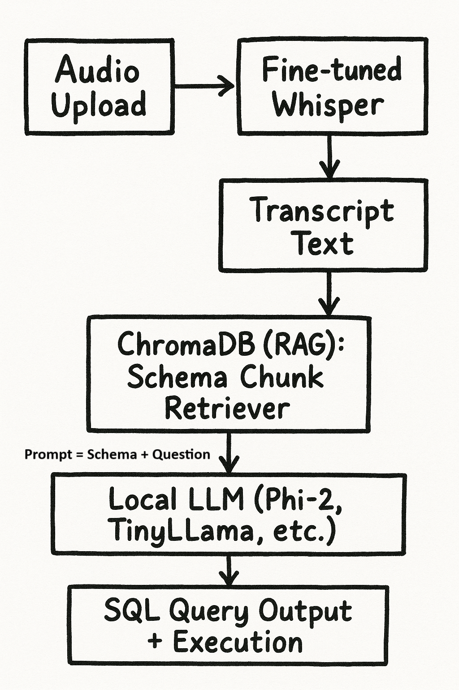
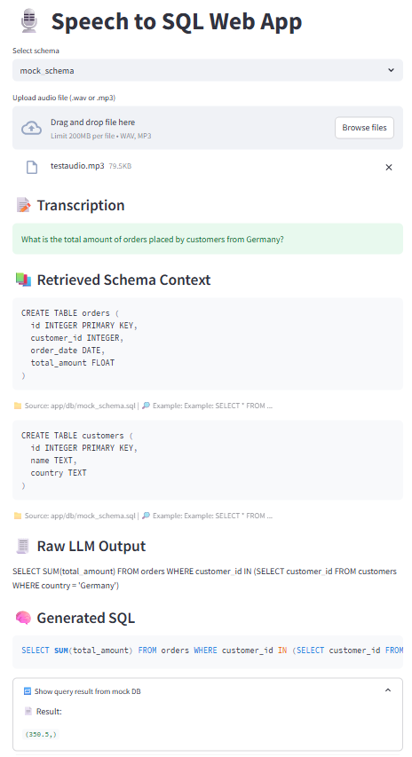

# Speech2SQL: Voice-Powered SQL Generation with RAG & GenAI


## 🔍 Project Overview

**Speech2SQL** is an end-to-end, voice-driven SQL query generation app. It uses a fine-tuned Whisper model for ASR (Automatic Speech Recognition), Retrieval-Augmented Generation (RAG) for schema understanding, and a local LLM (e.g., Phi-2, TinyLlama, Falcon) to generate executable SQL queries. All components are self-contained and run offline, making it ideal for secure environments.

---

## 🎯 Key Features

* **🎙️ Speech Input**: Upload voice/audio files in `.wav` or `.mp3`
* **🧠 ASR via Fine-Tuned Whisper**: Customized for Indian and Scottish accents
* **📚 RAG-based Schema Retrieval**: Uses ChromaDB to fetch relevant schema context
* **🧾 SQL Generation**: Uses local LLM (Phi-2, Falcon, or TinyLlama) for query formulation
* **🔁 Query Execution**: Run SQL on mock SQLite databases
* **🖥️ Streamlit UI**: Simple, interactive, browser-based front-end
* **⚡ Fully Offline**: All models run locally (ideal for air-gapped/GPU servers)

---

## 🧱 System Architecture



---

## ⚙️ Tech Stack

* **ASR**: [Whisper](https://github.com/openai/whisper), fine-tuned with Hugging Face Transformers
* **LLM**: [Phi-2](https://huggingface.co/microsoft/phi-2) or [TinyLlama](https://huggingface.co/NousResearch/TinyLlama-1.1B-Chat-v1.0)
* **Retriever**: [ChromaDB](https://docs.trychroma.com/) + Sentence Transformers
* **Frontend**: [Streamlit](https://streamlit.io/)
* **Database**: SQLite (mock schema)

---

## 🚀 Getting Started

### 1. Clone the Repo

```bash
git clone https://github.com/saran-nair/speech2sql.git
cd speech2sql
```

### 2. Install Dependencies

```bash
pip install -r requirements2.txt
```

### 3. Index Schema into Chroma

```bash
python app/rag/schema_indexer.py  # indexes mock_schema.sql
```

### 4. Launch the App

```bash
streamlit run app/ui/streamlit_app.py
```

Then open [http://localhost:8501](http://localhost:8501) in your browser.

> 💡 Use SSH tunneling if running on a remote GPU (e.g., on premise/private cluster):
> `ssh -L 8501:localhost:8501 your@remote.host`

---

## 📂 Project Structure

```
speech-to-sql-genai/
├── app/
│   ├── asr/                  # Whisper inference + audio utilities
│   ├── rag/                  # RAG logic (ChromaDB + indexer)
│   ├── llm/                  # Local LLM wrapper (SQL generation)
│   ├── ui/                   # Streamlit frontend
│   ├── db/                   # SQLite DB + schema files + Chroma store
├── Fine_Tuned_Model/         # Fine-tuned Whisper model
├── requirements2.txt
├── README.md
```

---

## 📌 Sample Schema Used

```sql
CREATE TABLE customers (
  id INTEGER PRIMARY KEY,
  name TEXT,
  country TEXT
);

CREATE TABLE orders (
  id INTEGER PRIMARY KEY,
  customer_id INTEGER,
  order_date DATE,
  total_amount FLOAT
);
```

---

## ✨ Example Use Case

**Voice Input**:

> "What is the total amount of orders placed by customers from Germany?"

**Generated SQL**:

```sql
SELECT SUM(total_amount) FROM orders
WHERE customer_id IN (
  SELECT id FROM customers WHERE country = 'Germany'
);
```

**Result**:

```
(350.5,)
```

---

## 🛣️ Roadmap

* [ ] Add support for multiple schemas (e.g., `employee_db`, `finance_db`)
* [ ] Enable microphone-based input (live voice recording)

---



## 🧠 Acknowledgements

* OpenAI Whisper for ASR
* Microsoft Phi-2 / TinyLlama for LLMs
* ChromaDB for simple RAG
* Hugging Face Transformers
* Streamlit for the UI

---

## 📜 License

[MIT](LICENSE)